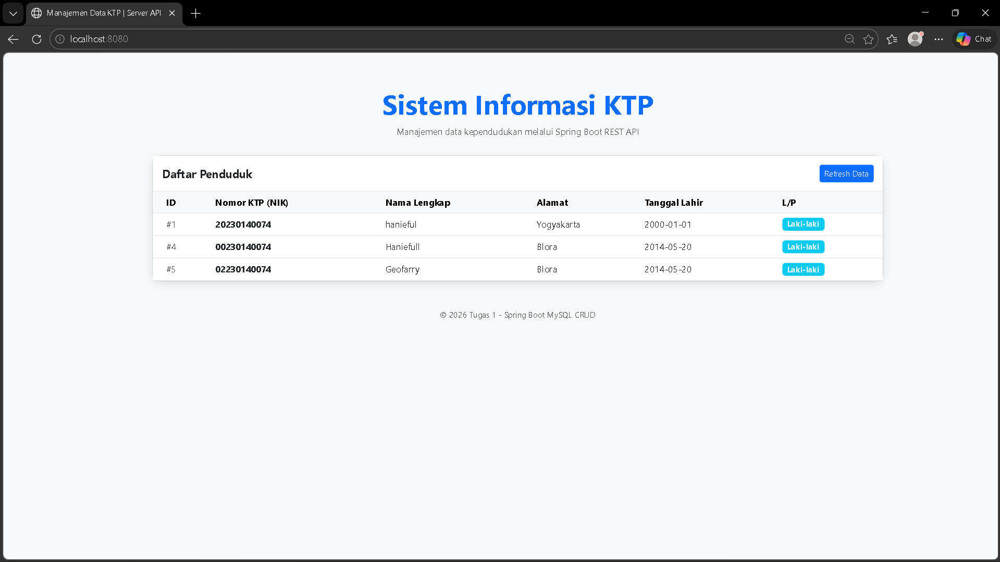
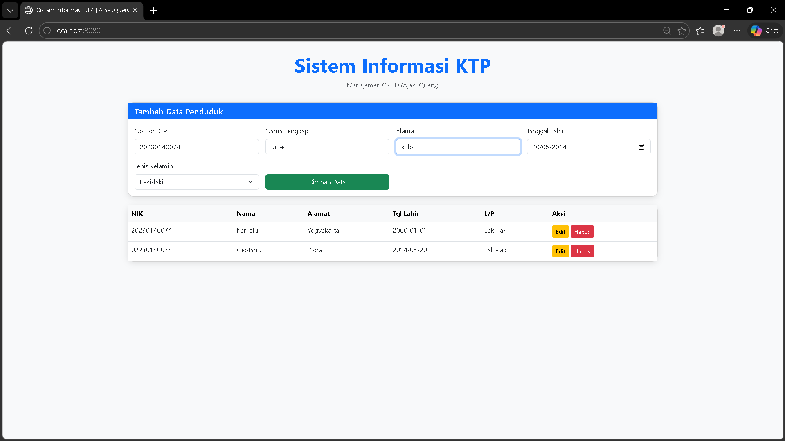
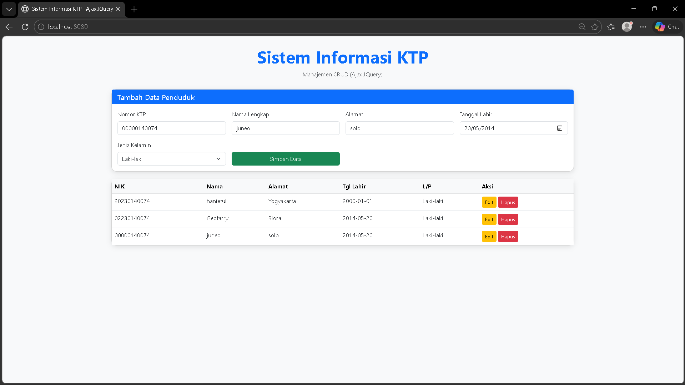
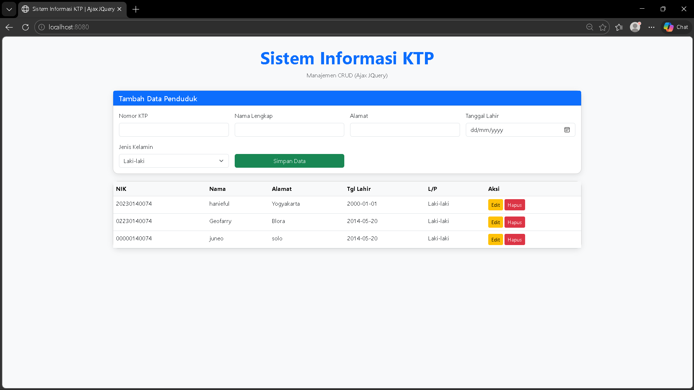
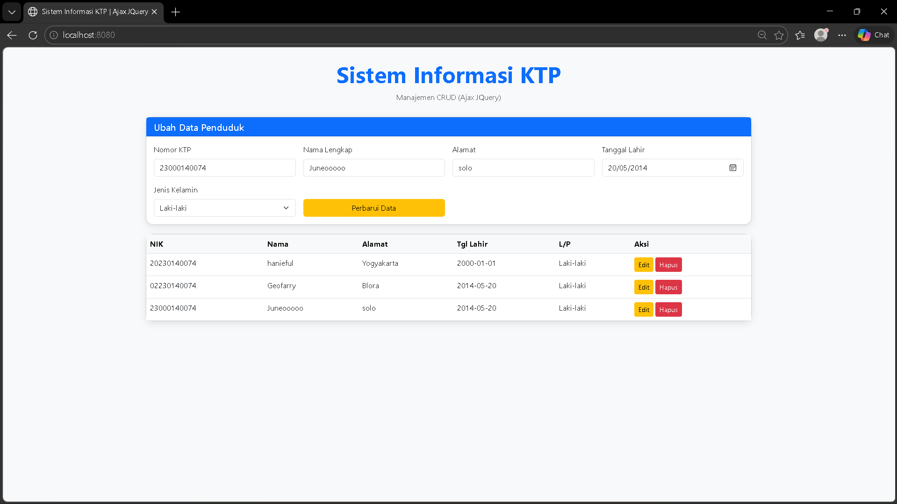
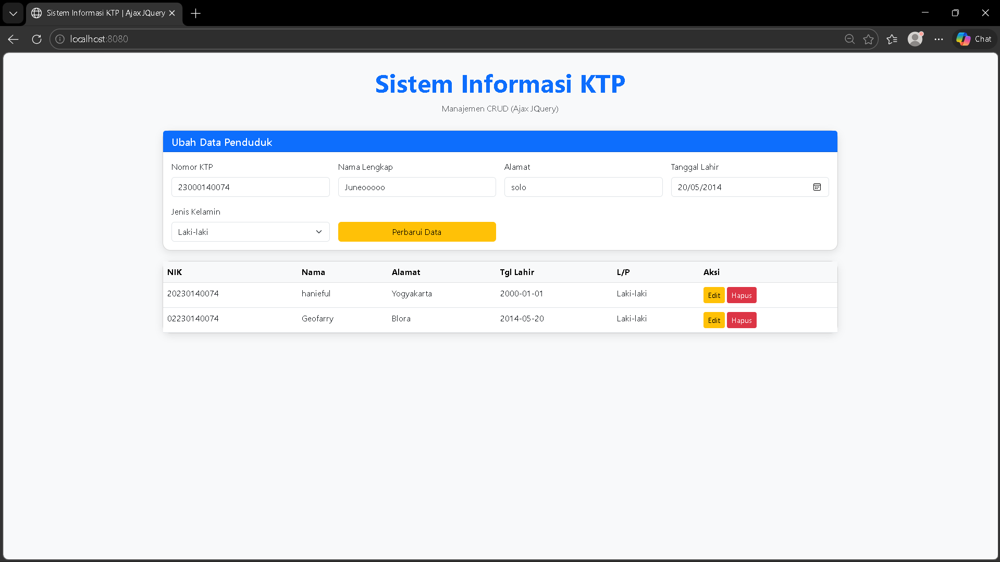
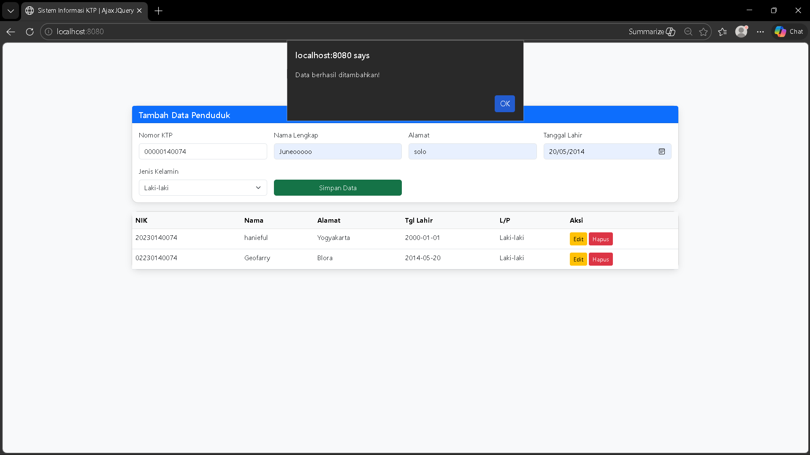
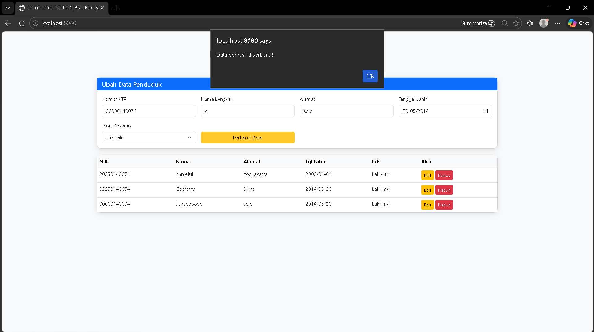
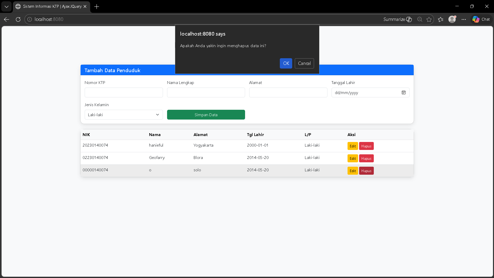
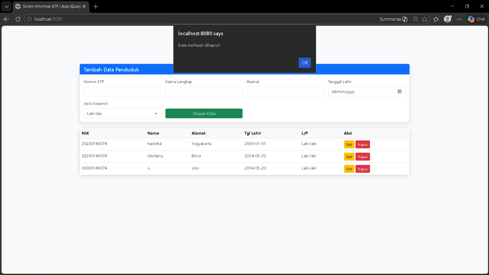

Tugas 1: Membuat Program di Server dengan API untuk CRUD KTP menggunakan Spring Boot dan MySQL
Dokumentasikan API dan screenshot tampilan website ke dalam Readme
- Screenshot Tampilan Website: 

- POST /ktp: Untuk menambah data KTP baru.

- GET /ktp: Untuk mengambil seluruh data KTP.

- GET /ktp/{id}: Untuk mengambil data KTP berdasarkan id.

- PUT /ktp/{id}: Untuk memperbarui data KTP berdasarkan id.

- DELETE /ktp/{id}: Untuk menghapus data KTP berdasarkan id.

- Screenshot Database: Menampilkan data yang masuk di MySQL (phpMyAdmin/Workbench).

Tugas 2: Membuat Program Client-side menggunakan HTML, CSS, JavaScript, dan Ajax JQuery
1. Tampilan Website

2. Operasi CRUD (Ajax JQuery & API)
      Tambah Data (POST) 
      Lihat Data (GET) 
      Update Data (PUT) 
      Hapus Data (DELETE) 
3. Feedback: notifikasi atau pesan kepada pengguna tentang hasil dari setiap operasi 
data berhasil ditambahkan
data berhasil diperbarui 
peringatan dihapus
berhasil dihapus
