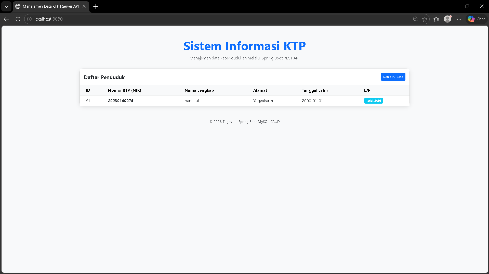
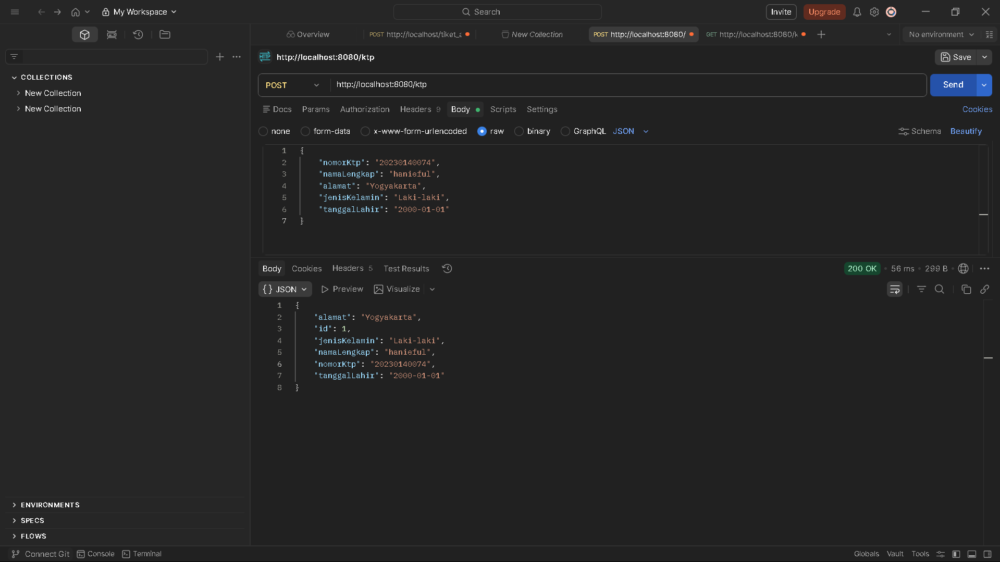
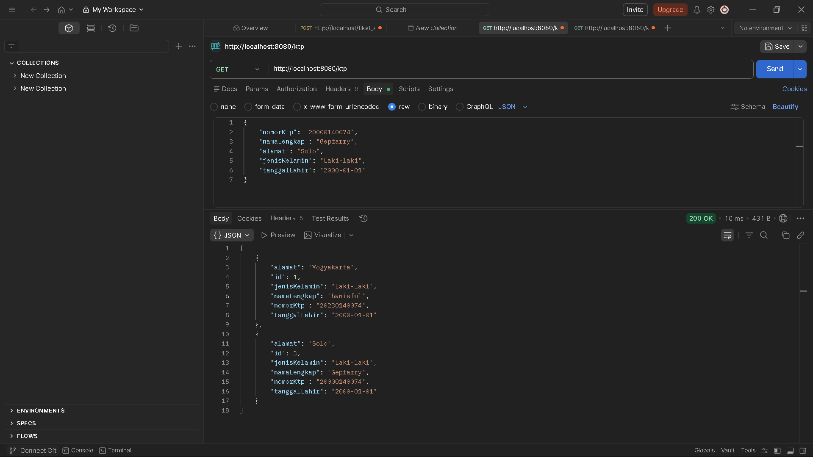
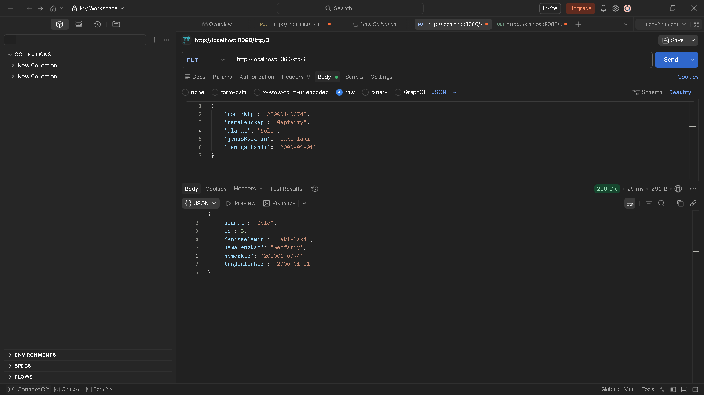
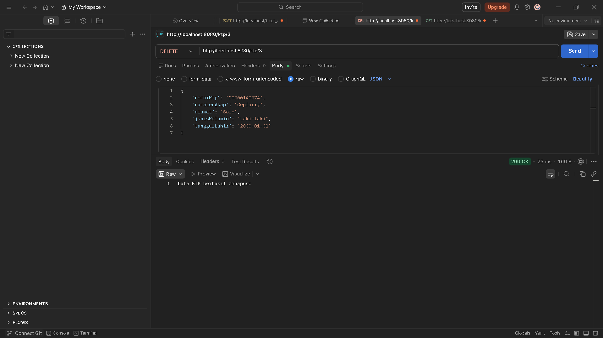

Tugas 1: Membuat Program di Server dengan API untuk CRUD KTP menggunakan Spring Boot dan MySQL
Dokumentasikan API dan screenshot tampilan website ke dalam Readme
- Screenshot Tampilan Website: 

- POST /ktp: Untuk menambah data KTP baru.

- GET /ktp: Untuk mengambil seluruh data KTP.

- GET /ktp/{id}: Untuk mengambil data KTP berdasarkan id.

- PUT /ktp/{id}: Untuk memperbarui data KTP berdasarkan id.

- DELETE /ktp/{id}: Untuk menghapus data KTP berdasarkan id.

- Screenshot Database: Menampilkan data yang masuk di MySQL (phpMyAdmin/Workbench).